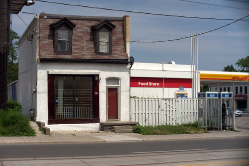

Build Cities with Green Spaces
==================================================

:category: Ideas
:summary: Build cities with green spaces so residents can have easy access to nature.

.. :slug: articles/ideas/build-cities-with-green-spaces
.. :url: articles/ideas/build-cities-with-green-spaces
.. :save_as: articles/ideas/build-cities-with-green-spaces.html

Lorem ipsum dolor sit amet, consectetur adipisicing elit, sed do eiusmod tempor incididunt ut labore et dolore magna aliqua. Ut enim ad minim veniam, quis nostrud exercitation ullamco laboris nisi ut aliquip ex ea commodo consequat. Duis aute irure dolor in reprehenderit in voluptate velit esse cillum dolore eu fugiat nulla pariatur. Excepteur sint occaecat cupidatat non proident, sunt in culpa qui officia deserunt mollit anim id est laborum.

|

**Parent:**
`How should cities be built? <{filename} ../questions/q-how-should-cities-be-built.rst>`_

**Questions:**

**Sources:**
`The economy of cities <{filename} ../sources/s-jacobs1970economy.rst>`_