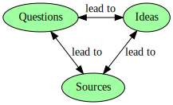

About Ambitious City
==================================================

:slug: about
:summary: What Ambitious City is all about

Ambitious City is an experimental site for urban design. The goal is to identify and refine good ideas for the design of cities. We have three items of interest: Questions, Ideas and Sources; [*Questions* are seen as the most important]. These items are linked together in a straightforward way. 

Why attempt to ask good questions about urban design? 
-----------------------------------------------------

- Good questions are important because they encourage curiosity
- Questions can lead to many ideas
- Questions also provide a *structure* for good ideas: a good idea is given a context by the question that may have inspired it. 

What makes a good question?
--------------------------------------------------

- One that is neither too broad nor too narrow
- One that 'cuts to the chase'
- One, that when asked, makes a situation clearer or more understandable 
- One to which preliminary answers are available without expending a huge amount of effort

|

	Relationship of items discussed within Ambitious City.